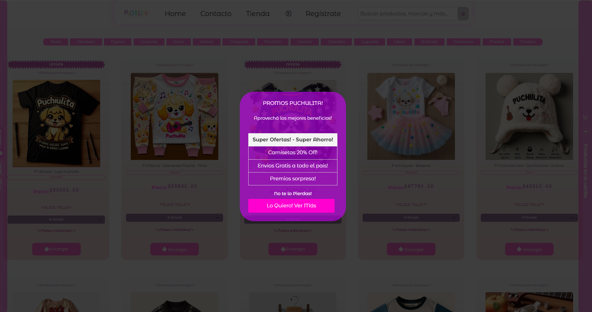

# Página de "Puchulita" -Tienda Musical Infantil-

## Descripción
Puchulita Música Infantil es una tienda online dedicada a la venta de productos musicales infantiles. Aquí encontrarás una variedad de productos, desde juguetes musicales hasta ropa para niños y niñas.

## Palabras Clave
Página de la tienda musical Puchulita.Tienda musical Infantil Puchulita, Música Infantil, musica infantil, puchulita musica infantil, productos infantiles musicales, juguetes, ropa de niños y niñas, ropa infantil, tienda infantil, rock, children rocks, musica, niños, niñas musica para niños y niñas, canciones para niños y niñas, cancion para niños y niñas.

## Tabla de Contenidos
1. [Instalación](#instalación)
2. [Uso](#uso)
3. [Archivos SASS](#archivos-sass)
4. [Componentes JSX](#componentes-jsx)
5. [Imágenes](#imágenes)
6. [SEO](#seo)
7. [Licencia](#licencia)
8. [Contacto](#contacto)

## Instalación
Para instalar y ejecutar este proyecto en tu máquina local, sigue estos pasos:

1. Clona el repositorio:
    ```bash
    git clone https://github.com/tu-usuario/tu-repo.git
    ```
2. Navega al directorio del proyecto:
    ```bash
    cd tu-repo
    ```
3. Instala las dependencias:
    ```bash
    npm install
    ```
4. Inicia el servidor de desarrollo:
    ```bash
    npm start
    ```

## Uso
Puedes acceder a la aplicación en [https://puchulitamusicainfantil.netlify.app/](https://puchulitamusicainfantil.netlify.app/).

## Archivos SASS
Los siguientes archivos SASS se utilizan en el proyecto para el diseño y la estructura:

- `00-responsive.scss`
- `01-body.scss`
- `02-main.scss`
- `03-header-nav.scss`
- `04-footer.scss`
- `05a-textos.scss`
- `05b-formularios.scss`
- `06-imagenes.scss`
- `07-grid-estructuras.scss`
- `08-cards.scss`
- `09-botones.scss`
- `10-animaciones.scss`
- `11-alerts-toasts.scss`
- `12-tienda.scss`
- `13-popups.scss`

## Componentes JSX
Los siguientes componentes JSX se utilizan en el proyecto para la funcionalidad de la aplicación:

- `AuthContext.jsx`
- `CarritoCompleto.jsx`
- `CarritoTienda.jsx`
- `Contacto.jsx`
- `DetalleProducto.jsx`
- `Footer.jsx`
- `Header.jsx`
- `ImageModal.jsx`
- `Login.jsx`
- `Logout.jsx`
- `MainContent.jsx`
- `Message.jsx`
- `MiniCarrito.jsx`
- `OfertasContext.jsx`
- `PopUpModal.jsx`
- `Producto.jsx`
- `ProductoLista.jsx`
- `ProductosTienda.jsx`
- `PublicidadDebajo.jsx`
- `SearchBar.jsx`
- `Tienda.jsx`
- `App.jsx`
- `main.jsx`

### Imágenes de Documentación





## SEO
- **Descripción**: Página de la tienda musical Puchulita.
- **Palabras Clave**: Tienda musical Infantil Puchulita, Música Infantil, musica infantil, puchulita musica infantil, productos infantiles musicales, juguetes, ropa de niños y niñas, ropa infantil, tienda infantil, rock, children rocks, musica, niños, niñas musica para niños y niñas, canciones para niños y niñas, cancion para niños y niñas.
- **Título**: Home - Puchulita Tienda Musical Infantil.
- **Open Graph**:
  - **Título**: Puchulita Música Infantil.
  - **Descripción**: Página del proyecto Musical Puchulita, música infantil.
  - **Imagen**: 
  - **URL**: [https://puchulitamusicainfantil.netlify.app/](https://puchulitamusicainfantil.netlify.app/)

## Instalación y Configuración

### Requisitos Previos
Asegúrate de tener instalados los siguientes programas:
- Node.js
- npm (Node Package Manager)

### Clonar el Repositorio
```bash
git clone https://github.com/tu-usuario/tu-repositorio.git
cd tu-repositorio